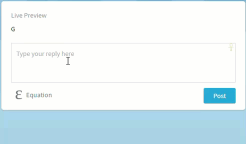
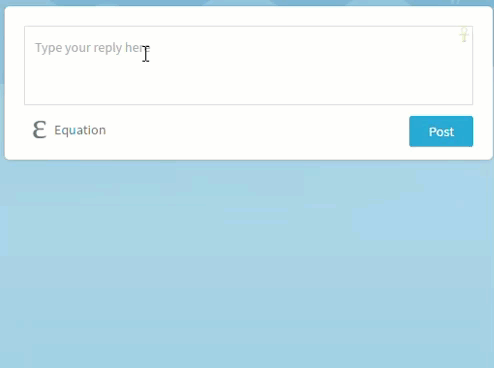

# answeroid

A simple bot for helping on Q&A sites.
<details>
<summary>**Demos**</summary>
  > <details>
<summary>
GCAL
</summary>
  > 
</details>
<details>
<summary>
WOLF
</summary>
  > 
</details>
<details>
<summary>
BING
</summary>
  > 
</details>
</details>

## Setup instructions (linux):
<details>
<summary>
1) Install the prerequisites:
</summary>
   > * [Python](https://www.python.org/)
   > * [virtualenv](https://virtualenv.pypa.io/en/stable/) (optional, but strongly recommended)
   > * [pip](https://pypi.python.org/pypi/pip)
</details>

<details>
<summary>
2) Get a Wolfram AppID from [Wolfram|Alpha Developer Portal](https://developer.wolframalpha.com/portal/myapps/):
</summary>
  > *(At the time of writing, a free app id allows you 2,000 queries per month per app)*

  > 1. Sign into the portal (sign up if you don't have an account already).
  > 2. Click on "Get an AppID"
  > 3. In the popup, fill in the Application Name and Description fields, and click on ***Get AppID***
  > 4. You should now see a ***Your AppID Has Been Created*** prompt with the following fields:
  >    * APP NAME: *the name you have entered*
  >    * APPID: **XXXXXX-XXXXXXXXX** - take a note of this app id
  >    * USAGE TYPE: Personal/Non-commercial Only
  > 5. If you closed the popup before taking down the app id, you can find it again in the [developer portal](https://developer.wolframalpha.com/portal/myapps/index.html). Just click on ***Edit*** under the corresponding app.
  > 6. Now that you have your app id, store it in an environment variable named `WOLF_APP_ID`. You can add it to your profile in order to avoid having to re-export it on every reboot - just add the line below (with your app id) to `~/.profile`.

  >      ```Shell
export WOLF_APP_ID='XXXXXX-XXXXXXXXX'
     ```
</details>

<details>
<summary>
3) <a name="3">Using ***answeroid***:</a>
</summary>
  > *(If you are planning on contributing to the project, please skip to [Step 4](#4))*

  > 1. Create a folder for your project:

  >    ```Shell
mkdir answeroid
    ```

  > 2. <a name="3-2">Create a virtual environment inside the project folder:</a>
   
  >    ```Shell
cd answeroid && virtualenv -p python3 ve
    ```
  >    * `-p` allows you to specify the python executable, this project uses Python 3
  >    * `ve` is just the name of your virtual environment - you can make it more descriptive, but I tend to use `ve` - short for virtual environment of said project, since it's inside the `project_folder` anyway
  > 3. <a name="3-3">Activate the created virtual environment:</a>

  >    ```Shell
source ve/bin/activate
    ```
  >    * You should see a `(ve)` (or the name of your virtual environment if you used something other than `ve`) prepended to your shell prompt. If not please double check the steps above.
  > 4. With the virtual environment active, install answeroid:

  >    ```Shell
pip install answeroid
    ```
  >    * This will download answeroid along with all of its dependencies.
</details>

<details>
<summary>
4) <a name="4">Contributing to ***answeroid***:</a>
</summary>
  > If you are going to contribute to ***answeroid***, instead of downloading it from pip, you will have to [fork this repository](https://help.github.com/articles/fork-a-repo/). Once you have forked the repo and cloned your fork, install the dependencies:

  > 1. Follow the steps [3-2](#3-2) and [3-3](#3-3) above
  > 2. With the virtual environment active, install all the required dependencies: `pip install -r requirements.txt`. This will download all the dependencies needed to run answeroid.
  > 3. See [Step 5](#5) for details on testing your changes/running the bot. These instructions will be updated accordingly when I add tests.
  > 4. When you are happy with your changes, send us a pull request. Pull requests adding new helpers, as well as enhancements to existing helpers are always welcome. Pull requests for Q&A site implementations are judged on a case by case basis.
</details>

<details>
<summary>
5) <a name="5">Running the bot:</a>
</summary>
  > *(I'm working on incorporating this bot into a Slack team chat, so a more concrete site example should be available soon)*

  > 1. Create a subclass of [`Site`](./sites/common.py#L4).
  >    * The idea is that, when deployed, the bot monitors your activity on said `Site` by periodically calling [`get_viewing_question`](/sites/common.py#L30) and scanning your replies on that question. When it finds relevant replies (i.e. `WOLF: query`, `BING: query`, or `GCAL: query`), it sends the `query` to the corresponding provider, and edits your reply with the results from the given provider
  > 2. Update the import statement in [main](./answeroid/main.py). Instead of importing `Site` from `sites.common`, import your subclass from the module where it is located and update the `with` clause in [main](./answeroid/main.py) accordingly.
  > 3. With the virtual environment still active, run [main](./answeroid/main.py) (assuming you're in the root directory of the project):

  >    ```Shell
(ve)user@pc:~/MyProjects/answeroid$ python answeroid/main.py
    ```
</details>

## Deployment instructions ([raspbian](https://www.raspberrypi.org/downloads/raspbian/)):

*Coming soon*
